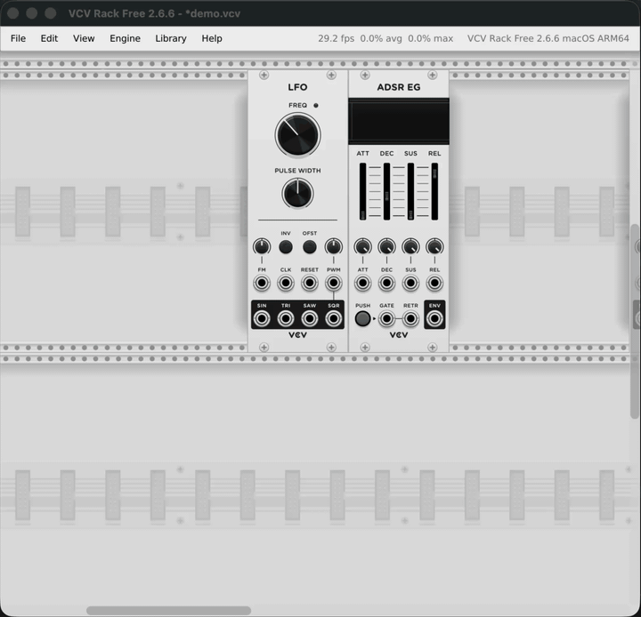

# Synth Duster VCV Rack Plugin

> Did you ever want to try the full potential of the Befaco Synth Duster but never had the resources to acquire one, or the time to wait for Behringer to make a cheap clone? **Now you have the unique opportunity to experience the full potential of the Befaco Synth Duster for FREE in VCV Rack 2.**



A physically-simulated 8HP brush for VCV Rack 2. Zero CV. Zero audio. Zero practical purpose. **Maximum vibes.**

## Features

- **8 HP.** The exact same width as the original. We measured.
- **Transparent panel.** You can see the rack rails *right through it*. It's not a module. It's a tool.
- **Per-bristle 2-D physics.** 101 independent bristles with their own displacement, velocity, spring stiffness, and damping. Each one is on its own journey.
- **Body-sampled collisions.** Each bristle is tested against obstacles at four points along its length, not just at the tip — so small jacks pushing near the base actually bend the bristle, the way you'd expect.
- **Real-time collision with knobs and jacks.** Drag the brush across a Frequency knob and the bristles bend around it like they're meant to.
- **Real-time collision with patch cables.** Each cable is approximated by the exact same quadratic-bezier slump formula VCV Rack itself uses, sampled into 24 segments — so collisions track the visible cable even when you change the **Cable Tension** in the View settings. Reverse-engineered, verified, slightly smug about it.
- **Two viewing modes.** Flip the on-panel switch: **side view** (you see the brush from the side, bristles standing up like an ill-mannered guest) or **top view** (you see the back of the handle, bristles point into the rack as Z, and only fan out from the wood's edges when an obstacle bends them).
- **Bristles around the full perimeter (top view).** Distributed proportionally around all four edges of the wooden block. Push the brush against a neighbor from any side and the bristles on *that* edge fan out, scaled by how hard they're being pushed.
- **Free-floating placement.** Forget the rail grid. Park the brush diagonally across three modules. Live your truth.
- **Snap-on-release.** Drop it close to a rail intersection and it commits like a real module, pushing neighbors aside Befaco-style.

<sup>† The bristles push back too, in a manner of speaking — but the cables don't actually move. Yet.</sup>

## Build it yourself

Requires the **VCV Rack 2 SDK** unpacked somewhere on your machine. By default
the Makefile expects it at `~/Rack-SDK`. Set `RACK_DIR` to point elsewhere.

```bash
# Build the plugin.
make RACK_DIR=$HOME/Rack-SDK

# Build and install into VCV Rack's user plugin dir.
make install RACK_DIR=$HOME/Rack-SDK

# Tear down build artifacts.
make clean
```

After `make install`, launch VCV Rack 2 and find the module under the **Synth Duster** brand. Drag it into your patch. Behold.

## Architecture, briefly

| File | Job |
|---|---|
| `src/plugin.{cpp,hpp}` | Standard VCV Rack plugin entry + model registration. |
| `src/Duster.cpp` | The `Module` (a single `MODE_PARAM`), the `BristleWidget` (per-bristle physics, body-sampled collisions, dual side/top rendering), the `DusterWidget` (free drag, snap-on-release, panel swap on mode change, child-order trickery to keep bristles behind the wood). |
| `src/Bristles.inl` | Generated. 101 `BristleDef` records — anchor, rest tip, width, colour. |
| `res/Duster_handle.svg` | Side-view panel: handle, wood grain, label. |
| `res/Duster_handle_top.svg` | Top-view panel: the same wood from above, narrowed so bristles have room to peek out on all four sides. |
| `res/Duster_bristles.svg` | Bristle source data. Never rendered at runtime — parsed by the generator. |
| `tools/gen_bristle_data.py` | Reads the bristle SVG, emits `src/Bristles.inl`. |

Tweak the art? Edit `res/Duster_bristles.svg`, re-run `python3 tools/gen_bristle_data.py`, rebuild.

Tweak the feel? Constants at the top of `BristleWidget` in `src/Duster.cpp`:

| Constant | What it does |
|---|---|
| `kStiffness`, `kDamping` | Side-mode spring that returns a bristle to its rest position. |
| `kTopStiffness` | Softer top-mode spring so weak side/top contacts still accumulate visible peek. |
| `kDragGainX`, `kDragGainY` | How much bristles lag when you drag the handle (side mode only — top mode has no surface friction). |
| `kContactDamping` | Velocity multiplier when a bristle hits something. |
| `kBodySamples` | How many points along each bristle's length get tested against obstacles. |
| `kCableRadiusPx` | How thick we consider a cable to be for collision. |
| `kCableSagBaseline`, `kCableSagPerPx` | Cable sag = `(1 − cableTension) × (baseline + perPx × distance)`. These match VCV Rack's slump formula. |
| `kTopAnchorInset` | How far inside the wood the top-mode bristle bases sit (controls how easily they peek out). |
| `kTopPeekScale` | mm of visible peek per mm of physics displacement, top mode. |
| `kTopPeekLatScale` | Tangential sway scale along the edge, top mode. |
| `kTopHandleX0/X1/Y0/Y1` | Perimeter rectangle bristles distribute around in top mode. Keep aligned with the wood-block rect in `Duster_handle_top.svg`. |
| `kMaxDispMm` | Clamp on bristle displacement so they can't fly off into orbit. |
| `DUSTER_DEBUG_OBSTACLES` | Define at the top of `Duster.cpp`. Set to `1` to overlay obstacle rects (cyan), cable segments (green tubes), and a count bar — handy when something isn't reacting. |

## Are you ready to buy the real thing?

The pixel brush in your rack is, in the end, made of pixels. The real one is made of actual bristles attached to actual wood, and it actually cleans your actual modules. If your wrist is sore from dragging fake bristles around with a mouse, treat yourself:

- **Official:** [Befaco — Synth Duster](https://www.befaco.org/synth-duster-2/)

Or pick one up from your favorite Eurorack dealer:

- [Perfect Circuit](https://www.perfectcircuit.com/befaco-synth-duster.html) (US)
- [Detroit Modular](https://www.detroitmodular.com/products/befaco-synth-duster) (US)
- [Signal Sounds](https://www.signalsounds.com/befaco-synth-duster-cleaning-brush) (UK)
- [Schneidersladen](https://schneidersladen.de/en/befaco-synth-duster) (DE)
- [Thomann](https://www.thomann.de/de/befaco_synth_duster.htm) (DE)

We get nothing if you click these. We just like our friends at Befaco.

## TODO

- [ ] **Convert to MetaModule.** A brush that only exists inside VCV Rack is, philosophically, still just pixels. Port to 4ms MetaModule so you can dust real Eurorack hardware *with* real Eurorack hardware. The recursion is the point. The form factor is also the point. The lawsuits are the consequence.
- [ ] Cables that actually move when you brush them. (Half the README's "yet" footnote depends on this.)
- [ ] Audible bristle scrub on contact. CV-controlled gain. Filter cutoff modulated by how angry the bristle is.
- [ ] **Wear and tear**: bristles that, after enough sustained collisions, become permanently bent. Right-click → "Replace head" returns them to factory. Patreon tier for a metal-bristled "Industrial" SKU.
- [ ] A "Befaco Mode" that requires you to insert a virtual Knurlies M3 screw via right-click context menu before it'll work. Authenticity matters.
- [ ] Multiplayer: drag your friend's brush across your patch over the network.
- [ ] Off-panel side peeks rendered as proper overlay above neighbor modules (currently capped by the panel boundary; "convert to MetaModule" sidesteps the problem entirely).

## Disclaimer

Unofficial. Fan-made. Not affiliated with, endorsed by, or financially supported by Befaco. The real Duster is a delightful physical product you should also buy. The author owns one. It is, in fact, dustier than this one.

No actual knobs were brushed in the making of this README.

## License

GPL-3.0-or-later. See `plugin.json` for metadata. Bristle artwork, handle SVG, and physics code are all original to this project.

## Credits

- The original Befaco Duster, for the inspiration.
- Andrew Belt and the VCV team, for shipping a synth host weird enough to host a brush.
- 4ms, for building hardware specifically so software brushes can one day go full circle.
- Everyone whose patch is too clean to need this. (Cowards.)
